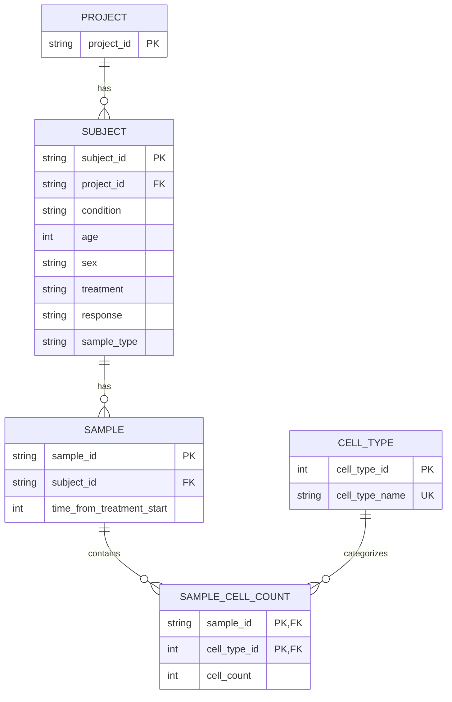

# Teiko Technical

## Setup Instructions

Makefile is created to help with setup. With make installed:

```
    make setup
    make pipeline
    make dashboard
```

## GitHub Codespaces (Recommended)

The easiest way to run this project is using GitHub Codespaces:

1. Click the green "Code" button on GitHub
2. Select "Codespaces" tab
3. Click "Create codespace on main"
4. Wait 3-5 minutes for automatic setup (installs dependencies and loads data)
5. Start the backend: `make dashboard`
6. Start the frontend in new terminal: `cd dashboard && npm run dev -- --host 0.0.0.0`
7. Click the "Ports" tab in VS Code and open port 5173 and 8001 to access the dashboard

The Codespace automatically installs all dependencies and loads the 10,500 sample dataset.

## Database Schema



The schema sepertes value in the flat csv into normalized tables based off assumed relationships. Project stores project identifier. Subject stores subject level data (id, parent project, condition, age, sex, treatment, responce, sample type). Sample type was considered subject level because it appears to be functionally dependednt on subject in the csv. Sample stores sample level data (id, parent subject, and time from treatment start). Sample cell count stores the different cell counts for each sample. Cell type catorigizes the cells that will be sampled.

Cell count was seperated into its own table, for proper normalization and future maintainability. In the given csv, each sample has five cell counts (b_cell, cd8_t_cell, cd4_t_cell, nk_cell, and monocyte). I chose to normalize this so that future samples can easily have more or less cell counts.

It was considered to put condition and treatment in their own type tables similar to the cell type table. I determined not to do this given that they have no attributes of their own and this would introduce more joins and more complexity. It would be useful to apply more constraints to the database, and reduce duplicate condition and treatment names. It is unnecissary for this analysis but should be considered cased on future scale.

The other normalizations were simply representing the relationships in the data appropiately. This reduces duplicate data and provides constraints to maintain data validity.

Indexes were created for foreign keys and otherwise added to the schema as useful for the analysis.

## Code Structure

The project follows a clean separation between backend (Python/FastAPI) with database (sqlite3), and frontend (React/TypeScript).

#### Backend Structure (`/src/teiko_technical/`)

```
src/teiko_technical/
├── api.py              # FastAPI application with REST endpoints
├── queries.py          # Database query functions
├── analysis.py         # Data transformation utilities
├── init_db.py          # Database initialization
└── load_csv_to_db.py   # CSV data loader
```

**Design Rationale:**
- **Separation of concerns:** api.py handles routing, queries.py handles SQL, keeping layers independent
- **Dynamic SQL generation:** Single hierarchical query builder supports 4 levels × 5 aggregation methods without 20 separate SQL files
- **Statistical test selection:** Automatically chooses appropriate test (Mann-Whitney for independent samples, mixed-effects for repeated measures)
- **Reusable query functions:** All queries parameterized and testable independently

#### SQL Structure (`/sql/`)

```
sql/
├── schema.sql          # Database schema definition
└── analysis/
    ├── frequency_data.sql              # Legacy frequency query
    ├── sample_cell_type_frequency.sql  # Sample-level frequency
    └── hierarchical_table_data.sql     # Template for hierarchical queries
```

**Design Rationale:**
- Modular SQL files for complex queries
- CTEs (Common Table Expressions) for readability
- Hierarchical query template supports dynamic aggregation 

#### Frontend Structure (`/dashboard/src/`)

```
dashboard/src/
├── api/
│   └── client.ts                      # API client functions
├── components/
│   └── HierarchicalTable/
│       ├── HierarchicalTable.tsx      # TanStack Table component
│       ├── TableControls.tsx          # Filter/search controls
│       ├── MultiSelectFilter.tsx      # Reusable multi-select dropdown
│       ├── ResizablePanes.tsx         # Split-pane layout
│       ├── columns.ts                 # Column definitions by level
│       └── columnDefaults.ts          # Default visibility config
├── pages/
│   ├── HierarchicalTablePage.tsx      # Main hierarchical table page
│   └── DashboardPage.tsx              # Legacy dashboard
├── services/
│   └── search-param-service.ts        # URL state management
├── types/
│   └── api.ts                         # TypeScript type definitions
└── App.tsx                            # Router configuration
```

**Design Rationale:**
- **TanStack Table + React Query:** Best-in-class libraries for virtualization, caching, and state management
- **URL state management:** All filters/level/aggregation stored in URL for shareable links (required for assignment submission)
- **Single hierarchical component:** One table component handles all 4 levels with dynamic columns (DRY principle)
- **Virtual scrolling:** Renders only ~50 visible rows instead of 52,500 (95%+ performance improvement)

#### Test Structure (`/tests/`)

```
tests/
├── test_database.py              # Database schema and constraint tests
├── test_api.py                   # Legacy API endpoint tests
├── test_hierarchical_api.py      # Hierarchical table API tests
└── test_hierarchical_queries.py  # Query function tests (if added)
```

## Dashboard Link

Dashboard is accessible at:
http://localhost:5173

#### Technical Rubric Shortlinks

Part 2:
- Data Overview Table:
http://localhost:5173/?level=cell&compare=none

Part 3: 
- Linear Mixed-Effects Model on Samples:
http://localhost:5173/?sample_type=PBMC&condition=melanoma&treatment=miraclib
- Mann-Whitney U test on Subjects:
http://localhost:5173/?sample_type=PBMC&condition=melanoma&treatment=miraclib&level=subject

Part 4:
1. Samples Filtered to Melanoma, Miraclib, PBMC, Time 0:
http://localhost:5173/?condition=melanoma&treatment=miraclib&sample_type=PBMC&time=0&compare=none
2. Projects Filtered to Melanoma, Miraclib, PBMC, Time 0:
http://localhost:5173/?condition=melanoma&treatment=miraclib&sample_type=PBMC&time=0&level=project
3. Subjects Filtered to Melanoma, Miraclib, PBMC, Time 0:
http://localhost:5173/?condition=melanoma&treatment=miraclib&sample_type=PBMC&time=0&level=subject
4. Subjects Filtered to Melanoma, Miraclib, PBMC, Time 0, Compared by Sex:
http://localhost:5173/?condition=melanoma&treatment=miraclib&sample_type=PBMC&time=0&level=subject&compare=sex


## AI Assistance Disclosure

This project was developed by Andrew Arthur with assistance from Claude Code (Anthropic's AI coding assistant).

**My work and design decisions:**
- System architecture and database schema design
- All project structure and organization decisions
- Technical approach for hierarchical data aggregation
- Statistical test methodology and selection criteria
- Frontend UX design and component architecture
- Code style guidelines and naming conventions
- Test strategy and coverage decisions
- All final code review and quality control

**Claude Code assisted with:**
- Implementation of designed architecture
- Code generation following my specifications
- Debugging and issue resolution
- Documentation writing
- Boilerplate and repetitive code tasks

All critical technical decisions, architectural choices, and design rationale were made by me. Claude Code served as an implementation assistant under my direction.
