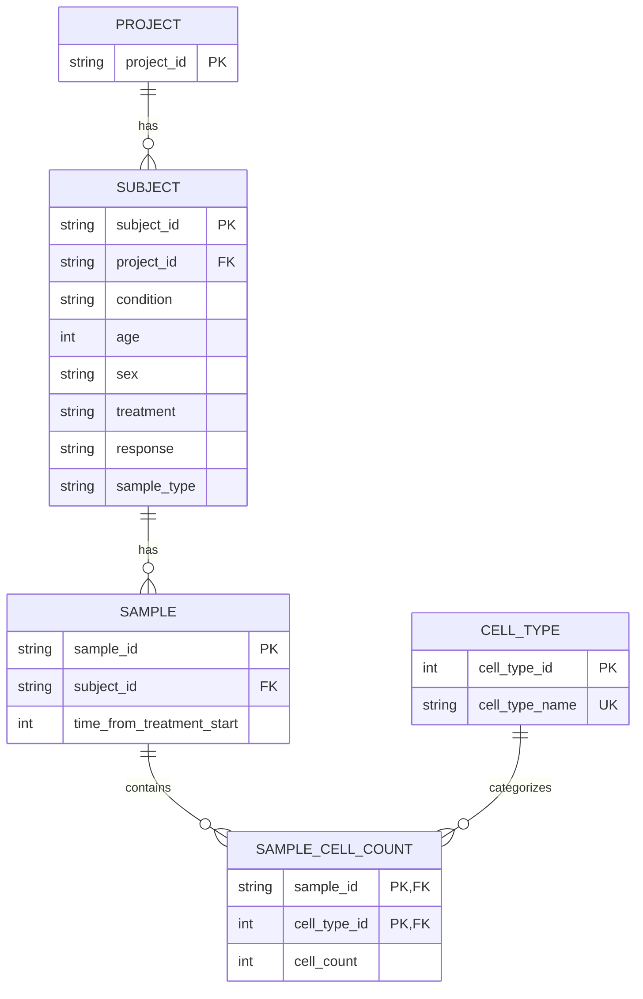

# Teiko Technical

## Setup Instructions

## Database Schema

The schema sepertes value in the flat csv into normalized tables based off assumed relationships. Project stores project identifier. Subject stores subject level data (id, parent project, condition, age, sex, treatment, responce, sample type). Sample type was considered subject level because it appears to be functionally dependednt on subject in the csv. Sample stores sample level data (id, parent subject, and time from treatment start). Sample cell count stores the different cell counts for each sample. Cell type catorigizes the cells that will be sampled.

Cell count was seperated into its own table, for proper normalization and future maintainability. In the given csv, each sample has five cell counts (b_cell, cd8_t_cell, cd4_t_cell, nk_cell, and monocyte). I chose to normalize this so that future samples can easily have more or less cell counts.

It was considered to put condition and treatment in their own type tables similar to the cell type table. I determined not to do this given that they have no attributes of their own and this would introduce more joins and more complexity. It would be useful to apply more constraints to the database, and reduce duplicate condition and treatment names. It is unnecissary for this analysis but should be considered cased on future scale.

The other normalizations were simply representing the relationships in the data appropiately. This reduces duplicate data and provides constraints to maintain data validity.

Indexes were created for foreign keys and otherwise added to the schema as useful for the analysis.

## Code Structure

## Dashboard Link

## AI Assistence Disclosure

All code and words in this project were written by me, Andrew Arthur, unless specified here.

ChatGPT was used to:

- Discuss schema design decisions with
- Helped generate test code for database
- Create mermaid ER diagram for .md
- Dissuss frontend architecure decisiions with
- Style the (part 2) sample cell type frequency table page
- Style the dashboard header
